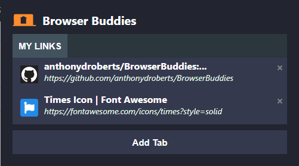

<a href="https://devpost.com/software/browser-buddies"></a>
# Browser Buddies
> Google Chrome Extension to share tabs with your friends

[]()

## Installation
Navigate to extension/src. Make a build of the source files.
```javascript
npm install
npm run build
```

Go to `chrome://extensions/` (enable Developer mode to be able to do this), and select `Load unpacked` and select the `extension/build` folder. The extension should now be installed on your chrome browser.


## Built With
* [Reactjs](https://reactjs.org/) - Web framework used
* [Nodejs](https://nodejs.org/en/) - Server environment used
Special mention to: [React Bootstrap](https://react-bootstrap.github.io/), [react-fontawesome](https://www.npmjs.com/package/@fortawesome/react-fontawesome), [react-lines-ellipsis](https://www.npmjs.com/package/react-lines-ellipsis)


## Team
* [Anthony Roberts](http://adroberts.me/)
* [Maya Saringan](https://www.mayasaringan.me/)